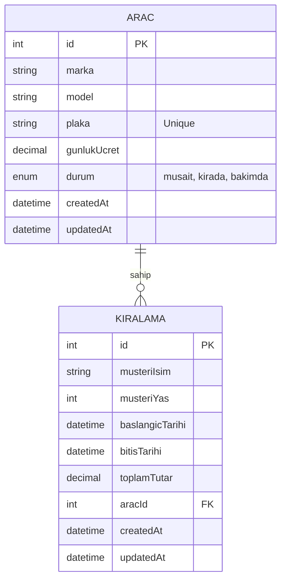

# RenterAPI
   

**RenterAPI**, araç kiralama işletmeleri için tasarlanmış, **Node.js**, **Express** ve **MySQL** teknolojileri kullanılarak geliştirilmiş modern ve ölçeklenebilir bir backend çözümüdür. RESTful mimari prensiplerine sadık kalarak, araç filosu yönetimi ve kiralama işlemlerini güvenli ve hızlı bir şekilde gerçekleştirir.

## 📄 Proje Açıklaması

RenterAPI, temel olarak bir araç kiralama şirketinin dijital altyapısını oluşturur. Müşterilerin araç kiralamasını, filonun durumunun (müsait, kirada, bakımda) takip edilmesini ve finansal hesaplamaların (günlük ücret üzerinden toplam tutar) otomatik yapılmasını sağlar. Transaction (işlem) yönetimi sayesinde veri tutarlılığını garanti eder; bir hata durumunda tüm işlemler geri alınır, böylece veri kaybı veya tutarsızlık yaşanmaz.

## 🎬 Senaryo Tanımı

Bir "Rent a Car" firması, filosundaki araçları ve kiralama geçmişini manuel yöntemlerle takip etmekte zorlanmaktadır. Araçların müsaitlik durumunun anlık olarak bilinememesi çifte rezervasyonlara yol açmaktadır. Ayrıca 21 yaş altı sürücülere kiralama yapılmaması gibi kuralların manuel kontrolü hataya açıktır.

**RenterAPI** bu sorunları şu şekilde çözer:
1.  **Envanter Yönetimi:** Araçların marka, model, plaka ve anlık durumları veritabanında saklanır.
2.  **Otomatik Kontroller:** Kiralama talebi geldiğinde sistem müşterinin yaşını (min 21) ve aracın müsaitliğini otomatik kontrol eder.
3.  **Durum Güncelleme:** Kiralama başladığında aracın durumu otomatik olarak 'kirada' statüsüne çekilir.
4.  **Fiyatlandırma:** Kiralama süresine göre toplam tutar sistem tarafından hesaplanır.

## 🚀 Kurulum Adımları

Projeyi kendi lokal ortamınızda çalıştırmak için aşağıdaki adımları izleyin.

### Gereksinimler
-   Node.js (v14 veya üzeri)
-   MySQL Veritabanı

### 1. Kurulum
Projeyi klonlayın ve bağımlılıkları yükleyin:

```bash
git clone https://github.com/username/RenterAPI.git
cd RenterAPI
npm install
```

### 2. Yapılandırma
Proje ana dizininde `.env` dosyasını oluşturun ve veritabanı bilgilerinizi girin (Örnek: `.env.example`):

```env
DB_HOST=localhost
DB_USER=root
DB_PASSWORD=sifreniz
DB_NAME=renterdb
PORT=3000
```

### 3. Veritabanı Kurulumu
Veritabanını oluşturmak, gerekli tabloları kurmak ve test verilerini yüklemek için tek bir komut yeterlidir:

```bash
npm run db:setup
```
*(Bu komut veritabanını oluşturur, tabloları senkronize eder ve örnek araç verilerini ekler.)*

### 4. Çalıştırma
Sunucuyu geliştirme modunda başlatın:

```bash
npm run dev
```

API artık `http://localhost:3000` adresinde aktiftir.

## 📡 API Endpoint Listesi

### 🚗 Araçlar (Cars)

| Metod | Endpoint | Açıklama |
| :--- | :--- | :--- |
| `GET` | `/api/cars` | Sistemdeki tüm araçları listeler. |
| `POST` | `/api/cars` | Sisteme yeni bir araç ekler. |
| `DELETE` | `/api/cars/:id` | Sistemden bir aracı siler. |

**Örnek Araç Ekleme Body:**
```json
{
  "marka": "BMW",
  "model": "320i",
  "plaka": "34 IST 34",
  "gunlukUcret": 2000
}
```

### 🔑 Kiralamalar (Rentals)

| Metod | Endpoint | Açıklama |
| :--- | :--- | :--- |
| `POST` | `/api/rentals` | Yeni bir kiralama işlemi başlatır. |
| `DELETE` | `/api/rentals/:id` | Bir kiralamayı iptal eder. |

**Örnek Kiralama Body:**
```json
{
  "musteriIsim": "Ayse Yilmaz",
  "musteriYas": 24,
  "baslangicTarihi": "2023-11-01",
  "bitisTarihi": "2023-11-05",
  "aracId": 1
}
```

*   **Not:** Kiralama işlemi sırasında yaş kontrolü (min 21) ve araç müsaitlik kontrolü otomatik yapılır.
*   **Not:** Kiralama iptal edildiğinde (silindiğinde), ilişkili araç otomatik olarak tekrar 'musait' durumuna geçer.

## 📊 ER Diyagramı

Aşağıda veritabanı şemasının Varlık-İlişki (Entity-Relationship) diyagramı yer almaktadır.



## 👤 Geliştirici (Author)

**Uygar Gültekin**
